# CI-Swag PP5

[(Developer: Darrach Barneveld)](https://github.com/DarrachBarneveld)

[Link to deployed site](https://ci-swag-e9f8de0bed4b.herokuapp.com/)

CiSwag is an online product shop and course enrollment platform, built using Python, Django, HTML, CSS, JavaScript, Amazon S3 and Stripe.

# Table Of Content

- [User Experience](#user-experience)
  - [User Stories](#user-stories)
  - [Site Goals](#site-goals)
  - [Scope](#scope)
- [Design](#design)
  - [Colour Scheme](#colour-scheme)
  - [Database Schema](#database-schema)
  - [Fonts](#fonts)
  - [Wireframes](#wireframes)
  - [Agile Methodology](#agile-methodology)
    - [Overview](#overview)
    - [EPICS(Milestones)](#epics---milestones)
    - [User Stories Issues](#user-stories---issues)
    - [MoSCoW prioritisation](#moscow-prioritisation)
    - [GitHub Projects](#github-projectskanban)
    - [Late Design Changes](#late-design-changes)
- [Features](#features)
  - [Navigation Header](#navigation-header)
  - [Footer](#footer)
  - [Home Page](#home-page)
  - [Post Detail Page](#post-detail-page)
  - [Profile Page](#profile-page)
  - [Edit/Add Post Page](#addedit-post-page)
  - [Edit Profile Page](#edit-profile-page)
  - [Code of Conduct Page](#code-of-conduct-page)
  - [Sign Up Page](#sign-up-page)
  - [Sign In Page](#sign-in-page)
  - [Sign Out Page](#sign-out-page)
  - [Article Preview Card](#article-preview-card)
  - [Notification Messages](#notification-messages)
  - [Confirmation Modal](#confirmation-modal)
  - [Toggle Favourites](#toggle-favourites)
  - [Comment Card](#comment-card)
  - [Comment Form](#comment-form)
  - [Pending Post](#pending-post)
  - [Error Pages](#comment-form)
  - [Future Features](#future-features)
- [Testing](#testing)
- [Bugs](#bugs)
- [Technologies and Languages](#technologies-and-languages)
  - [Languages](#languages-used)
  - [Python Modules](#python-modules-imported)
  - [Technologies and programs](#technologies-and-programs)
- [Deployment](#deployment)
  - [Pre Deployment](#pre-deployment)
  - [Deploying on Heroku](#deploying-on-heroku)
  - [Fork the Repository](#fork-the-repository)
  - [Clone the Repository](#clone-the-repository)
  - [Run the Repository Locally](#run-the-repository-locally)
- [Credits](#credits)
  - [Content](#content)
  - [Media](#media)
  - [Code](#code)
  - [Acknowledgements](#acknowledgements)

## User Experience

### User Stories

1. As a developer I can setup a new Django project so that I can create the project's structure [#1](https://github.com/DarrachBarneveld/ci-swag/issues/1)
2. As a developer, I can perform an early deployment of the application to verify the functionality of the initial setup so that I can continue testing the application as it evolves during development. [#2](https://github.com/DarrachBarneveld/ci-swag/issues/2)
3. As a developer I can connect database, static/media storage and stripe payments so that data is accessible on deployment and payments are configured early [#3](https://github.com/DarrachBarneveld/ci-swag/issues/3)
4. As a developer I can choose a colour theme so that all pages have a consistent feel and style. [#4](https://github.com/DarrachBarneveld/ci-swag/issues/4)
5. As a developer I can layout wireframes so that I have a clear idea of the sites structure and theme. [#5](https://github.com/DarrachBarneveld/ci-swag/issues/5)
6. As a Developer, I want to ensure the styling and theme of the website are consistent with intuitive UI/UX so that users easily digest content and perform all actions with ease. [#6](https://github.com/DarrachBarneveld/ci-swag/issues/6)
7. As a User I can intuitively navigate through the website so that I can view all content with ease. [#7](https://github.com/DarrachBarneveld/ci-swag/issues/7)
8. As a user I want the website to be responsive so I can view it on multiple devices [#8](https://github.com/DarrachBarneveld/ci-swag/issues/8)
9. As a developer, I can plan out multiple apps that have clear separation of function so that a larger scale project can be broken down into smaller modules [#9](https://github.com/DarrachBarneveld/ci-swag/issues/9)
10. As a developer, I can create data model classes for products so that structure my data effectively develop relationships between each type [#10](https://github.com/DarrachBarneveld/ci-swag/issues/10)
11. As a developer, I can create data model classes for programs so that structure my data effectively develop relationships between each type [#11](https://github.com/DarrachBarneveld/ci-swag/issues/11)
12. As a developer, I can create data model classes for subscriptions so that structure my data effectively develop relationships between each type [#12](https://github.com/DarrachBarneveld/ci-swag/issues/12)
13. As a developer, I can create data model classes for profile so that structure my data effectively develop relationships between each type [#13](https://github.com/DarrachBarneveld/ci-swag/issues/13)
14. As a developer, I can create data model classes for orders so that structure my data effectively develop relationships between each type [#14](https://github.com/DarrachBarneveld/ci-swag/issues/14)
15. As a site owner, I can see all my models and data through an admin portal so I can effectively manage my data through CRUD requests [#15](https://github.com/DarrachBarneveld/ci-swag/issues/15)
16. As a User, I can create or login into my account so that I can retrieve my preexisting secure data [#16](https://github.com/DarrachBarneveld/ci-swag/issues/16)
17. As a User, I can log out so that I can secure my account from other users [#17](https://github.com/DarrachBarneveld/ci-swag/issues/17)
18. As a developer, I can create mock data so that the final application has products, programs and other required models immediately created [#18](https://github.com/DarrachBarneveld/ci-swag/issues/18)
19. As a developer, I can have a base template so that all other templates can inherit from it and keep consistant theming [#19](https://github.com/DarrachBarneveld/ci-swag/issues/19)
20. As a User, I can visit the home page so that I can get a understanding of what the website content is about and navigate through [#20](https://github.com/DarrachBarneveld/ci-swag/issues/20)
21. As a developer, I can create data model classes for categories so that structure my data effectively develop relationships between each type [#21](https://github.com/DarrachBarneveld/ci-swag/issues/21)
22. As a User, I can visit the product page so that I can view all products available to purchase [#22](https://github.com/DarrachBarneveld/ci-swag/issues/22)
23. As a User, I can see standardised product preview card, providing key information at a glance so I can quickly make a decision [#23](https://github.com/DarrachBarneveld/ci-swag/issues/23)
24. As a User, I can visit the product detail page so that I can get more information on the product and add it to my card [#24](https://github.com/DarrachBarneveld/ci-swag/issues/24)
25. As a User, I can use a search bar to narrow down search results so that I can quickly find products/programs tailored to me [#25](https://github.com/DarrachBarneveld/ci-swag/issues/25)
26. As a User, I can visit the program page so that I can view all program available to enroll in [#26](https://github.com/DarrachBarneveld/ci-swag/issues/26)
27. As a User, I can visit the program detail page so that I can get more information on the program and add it to my cart [#27](https://github.com/DarrachBarneveld/ci-swag/issues/27)
28. As a User, I can see standardised program preview card, providing key information at a glance so I can quickly make a decision [#28](https://github.com/DarrachBarneveld/ci-swag/issues/28)
29. As a User, I can add and remove items from my shopping cart so that I can manage my purchases easily and efficiently. [#29](https://github.com/DarrachBarneveld/ci-swag/issues/29)
30. As a User, I can view detailed information about items in my shopping cart on the cart detail page, so that I can review my items before proceeding to checkout. [#30](https://github.com/DarrachBarneveld/ci-swag/issues/30)
31. As a User, I can easily identify and interact with individual items in my shopping cart through standardised cart item cards, so that I can quickly review and manage my selections. [#31](https://github.com/DarrachBarneveld/ci-swag/issues/31)
32. As a User, I can receive notification messages whenever a CRUD (Create, Read, Update, Delete) action is taken, so that I am informed about the outcome of my actions and any relevant changes. [#32](https://github.com/DarrachBarneveld/ci-swag/issues/32)
33. As a User, I can visit the subscription page so that I can view all subscriptions available [#33](https://github.com/DarrachBarneveld/ci-swag/issues/33)
34. As a User, I can view a checkout page so that I can get a run down of items and my total charge [#34](https://github.com/DarrachBarneveld/ci-swag/issues/34)
35. As a developer, I can view and manage line items within orders to track my purchase accurately and efficiently. [#35](https://github.com/DarrachBarneveld/ci-swag/issues/35)
36. As a User, I can securely process my order based on the checkout so that I can buy products from the store [#36](https://github.com/DarrachBarneveld/ci-swag/issues/36)
37. As a Developer, I can securely complete my payment using Stripe integration with webhooks, ensuring that my transaction is protected and verified. [#37](https://github.com/DarrachBarneveld/ci-swag/issues/37)
38. As a User, I can get sales and member discounts so that I can get items at a better price [#40](https://github.com/DarrachBarneveld/ci-swag/issues/40)
39. As a User, I can remove my active membership so that I can opt out of payments [#41](https://github.com/DarrachBarneveld/ci-swag/issues/41)
40. As a User, I can visit a profile page so that I can view my personal details and update them [#42](https://github.com/DarrachBarneveld/ci-swag/issues/42)
41. As a User, I can view my past orders on the profile page so that I can track my purchase history and review previous transactions. [#43](https://github.com/DarrachBarneveld/ci-swag/issues/43)
42. As a User, I can view the order confirmation page to see the details of my recent order so that I can verify the items purchased and their prices. [#44](https://github.com/DarrachBarneveld/ci-swag/issues/44)
43. As a User, I can access a my courses page where I can view all the courses I have bought or enrolled in, so that I can easily track my learning progress and access course materials. [#45](https://github.com/DarrachBarneveld/ci-swag/issues/45)
44. As a User, I want to receive a confirmation email after registering for an account, so that I can verify my email address and activate my account. [#46](https://github.com/DarrachBarneveld/ci-swag/issues/46)
45. As a User, I can receive an order confirmation emails after successfully completing a purchase, so that I have a record of the transaction and can review the details of my order. [#47](https://github.com/DarrachBarneveld/ci-swag/issues/47)
46. As a User, I can see a loading spinner so that I know my actions were registered and a result in pending [#48](https://github.com/DarrachBarneveld/ci-swag/issues/48)
47. As a User, I can see my current membership level so that I know what discounts I can avail of [#49](https://github.com/DarrachBarneveld/ci-swag/issues/49)
48. As a User, I can access a short video on the program page if I am enrolled in a course, so that I can get a mock studying experience. [#50](https://github.com/DarrachBarneveld/ci-swag/issues/50)
49. As a User, I can discover related products and programs on the program page, so that I can explore additional resources or offerings that complement my current selection. [#51](https://github.com/DarrachBarneveld/ci-swag/issues/51)

### Site Goals

1. Sell coding merchandise to cater to the coding community's needs and interests.
2. Offer subscription for discounts to incentivise repeat purchases and foster customer loyalty.
3. Provide short online courses to empower users with coding skills and knowledge.
4. Encourage community engagement and interaction to build a strong coding community.
5. Curate educational resources and content to support continuous learning and skill development.
6. Execute effective marketing and promotion strategies to attract and retain customers.

### Scope

The project combines an online store with an educational hub focusing on coding. Users can shop for coding-related merch and also access short courses to boost their coding skills/knowledge. CI-Swag aims for user-friendliness, accessibility, and enjoyment. It ensuring a smooth experience for both shoppers and learners. Members will also have access to rewards and course discounts to foster a wider community. The platform will encompass the following key features:

1. [EPIC - Initial Set Up:](https://github.com/DarrachBarneveld/ci-swag/milestone/1)

- Developers can set up a new Django project to create the project's structure.
- Database and media storage will be connected to ensure data storage and retrieval.
- An early deployment of the application will be carried out to confirm the initial setup's functionality.

2. [EPIC - UX Design Planning:](https://github.com/DarrachBarneveld/ci-swag/milestone/2)

- The website will be responsive, allowing users to access it on both desktop and mobile devices.
- The website will have a consistant theming throughout
- The websites navigation will be inituitve and allow multiple methods of accessing content

3. [EPIC - Data Modelling:](https://github.com/DarrachBarneveld/ci-swag/milestone/3)

- Developers can model the products, profiles, program, subscription and order model
- Models will each have a relationship to each other
- Fixtures will be used to prepopulate data for the store and dynamic content
- User profile/order models will be malleable and th only content subject to CRUD

4. [User Authentication:](https://github.com/DarrachBarneveld/ci-swag/milestone/4)

- Account registration is available for users, granting them full access to CISwag features.
- Once registered, users can log in to access their profiles, courses and subscriptions
- Non authenticated users can still purchase item/merch from the store

5. [EPIC - Site Layout:](https://github.com/DarrachBarneveld/ci-swag/milestone/5)

- Users navigate to their profile page to view and manage their account details, preferences, and order history.
- Users explore product pages to access detailed information about individual items, including descriptions, images, prices, and reviews.
- Users interact with the cart page to review and modify their selected items before proceeding to checkout.
- Users visit the checkout page to complete their purchases by providing shipping and payment details.
- Users browse program pages to discover and enroll in short online courses, accessing course descriptions, schedules, and enrollment options.
- Users engage with the order page to track the status of their orders, view shipping updates, and access order confirmation details.
- Users explore the home page to discover popular articles, featured products, and upcoming courses, providing a curated overview of available content.
- Users navigate category pages to explore articles, products, and courses grouped by relevant topics or themes, facilitating targeted browsing and discovery.

6. [EPIC - UI UX Styling:](https://github.com/DarrachBarneveld/ci-swag/milestone/6)

-Users can navigate intuitively through a visually appealing interface designed for emotional resonance and ease of use.

- Enhance user engagement with interactive elements and responsive design for seamless interactions across devices.
- Improve readability and focus with effective use of whitespace and clear visual hierarchy.
- Optimise performance to ensure fast loading times, enhancing overall user satisfaction and experience.

7. [EPIC - Cart And Checkout:](https://github.com/DarrachBarneveld/ci-swag/milestone/7)

- Users seamlessly add items to their cart and proceed to a user-friendly checkout process.
- Simplify checkout with a clear and concise process, guiding users through each step smoothly.
- Intergration of Stripe payment processing/webhooks for security of payments
- Order processing and storage within user models and database
- Administration access to view all orders that are logged in the database
- Handling of both authenticated on anonymous users payments and confirmations of orders

Benefits of key features and the EPIC Milestone Approach:

1. Guided Progress: Each issue is placed into a milestone and the tasks/open issues are tracked

2. Adaptability: This approach promotes flexibility as each issue is clearly linked to a broader scope

## Design

The primary design goal of the CI Swag was to focus clear categorisation of products, programs and memberships. The website must be clearly distinguisted from the ecommerce platform of products to the edu paid courses section.

The primary objective of our website design was to ensure an incredibly user-friendly and efficient navigation experience. This was achieved through an intutive filtering system of products, rendering of related items and a responsive and clean navigation menu. Links in various areas of pages also provide return navigation options.

I wanted clear seperation between authenticated users and non authenticated users. Users can access more content if authenticated and could view order history, enrolled programs and can update fields.

I wanted the design to be consistant though each page to have a unique feel to it. This was acheived through resuable component cards and a consistancy of colour, buttons, forms and other UI elements. I want the user to feel as if using the website was a fun and engaging experience as if browsing a shop in person.

This commitment to intuitive navigation and user-focused design principles remained at the forefront of project's development.

### Colour Scheme

The websites colour theme closly mimics Code Institutes colour theme. The use of orange, black, white and grey are the primary colours to help mimic the feel. Action components such as checkout, pay now or update forms are clearly distinguished with a bold blue or green colour, while all other less important/navigation buttons are consistant with the theme.

### Database Schema

### Models

#### Allauth User Model

The User model is an integral component of Django Allauth, featuring pre-established fields as part of its standard configuration. Among these fields are username, email, name, password, and others. This model primarily serves the purpose of user authentication, which is why it is not recommended to make direct alterations to it. Furthermore, the User model is linked to the Profile model through a one-to-one relationship, facilitating the management of user-specific data and interactions.

#### Profile Model

Profile Model: The Profile Model provides a snapshot of each user's presence on the platform, encapsulating their user information, delivery information and order history. It is has a one to one relationship with the auth User Model.

#### Category Model

The Category Model categorises products and programs, ensuring users can easily discover relatable products/programs.

#### Product Model

The Product Model is one of the main models of the application and is closely similar to the program model. It includes image, price, name, description, sku, discounts, sale and rating.

#### Program Model

The program model contains all fields of the product model with extra field such as difficulty, videourl and length that are unique to it.

#### Subscription Model

The subscription model is a model that holds information about a users membership. It has one to many relationship with a userprofile. A subscription contains discounts amounts on products and programs.

#### Order Model

The Order model contains information about a purchase. It contains lineitems of products. Products are based on a generic key type as they can be either products, programs or subscriptions. Its fields are date, lineitems, delivery, user and total cost.

### Fonts

The font used in this project is Segoe UI Roboto, which give a standard feel as mimiced in the CI website.  

### Wireframes

#### Desktop

Home

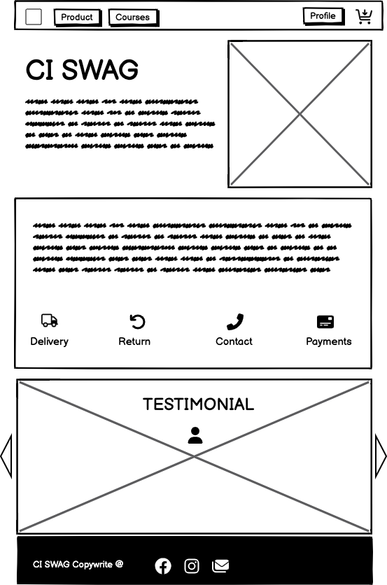

Products

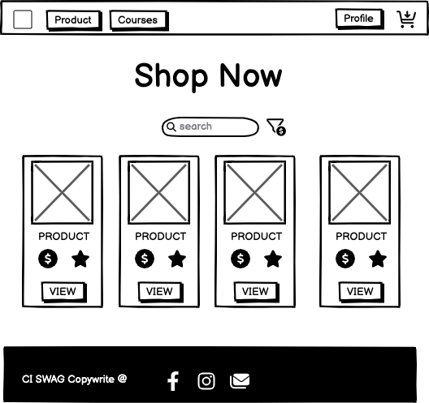

Product Detail

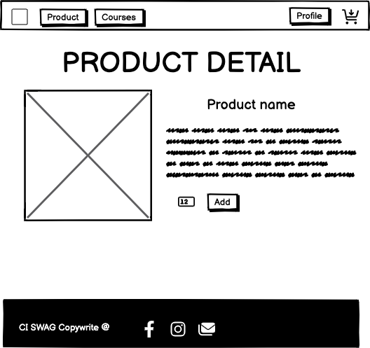

Programs

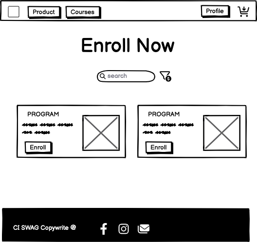

Program Detail

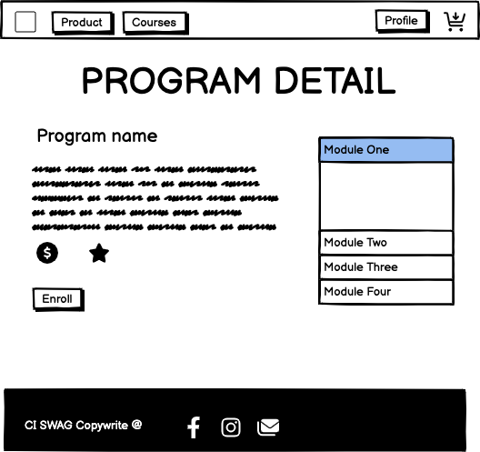

Subscription

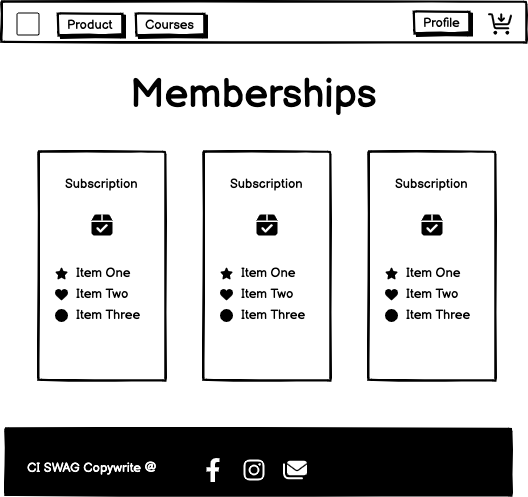

Cart

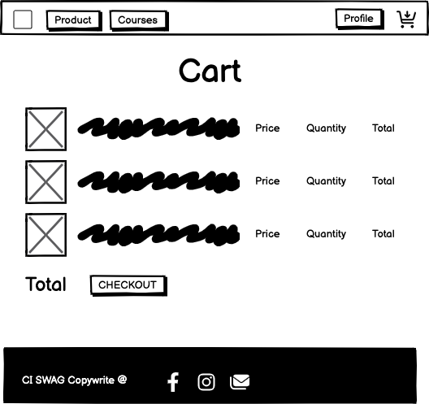

Checkout

Profile

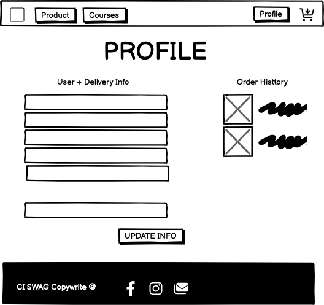

Courses

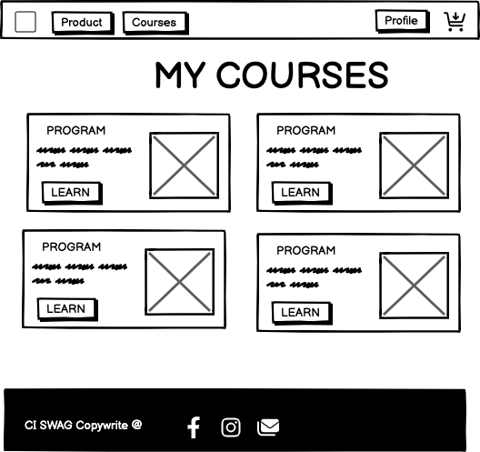

Login/Register

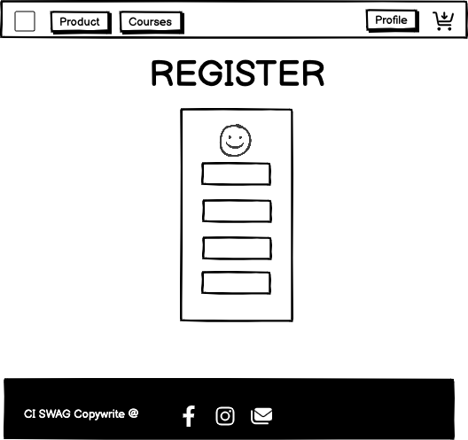

Thank You

#### Mobile

Home

Products

Product Detail

Programs

Program Detail

Subscription

Cart

Checkout

Profile

Courses

### Agile Methodology

#### Overview

This project adhered to agile principles, allowing for the meticulous planning of website features through the creation of user stories. Each story included specific acceptance criteria and tasks, facilitating clear objectives. Grouping these stories into EPIC milestones enabled a focused approach to addressing key elements of the site, ensuring necessary prerequisites were distinctly outlined for successful implementation.

#### EPICS - Milestones

In the Agile methodology framework, user stories are categorised into eight EPICs or Milestones. Moreover, an additional set of Milestones, referred to as Error Handling, was established specifically to address any errors encountered during testing, development, or optimisation of site elements with refined code or enhancements.

Milestones

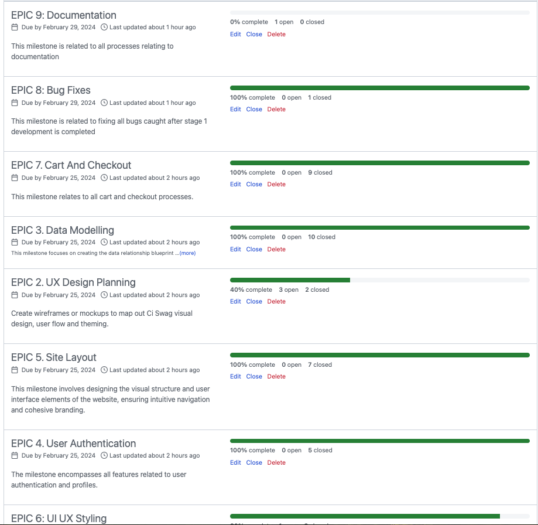

#### User Stories - Issues

The user story issue format includes the user story, acceptance criteria, and tasks, detailing essential steps for issue resolution. Whenever feasible, commit messages are linked to their respective issues during development, ensuring the significance of each commit and visually tracking progress on project issues. Milestones, Kanban boards, and other Agile tools are employed to monitor these issues effectively.

User Story

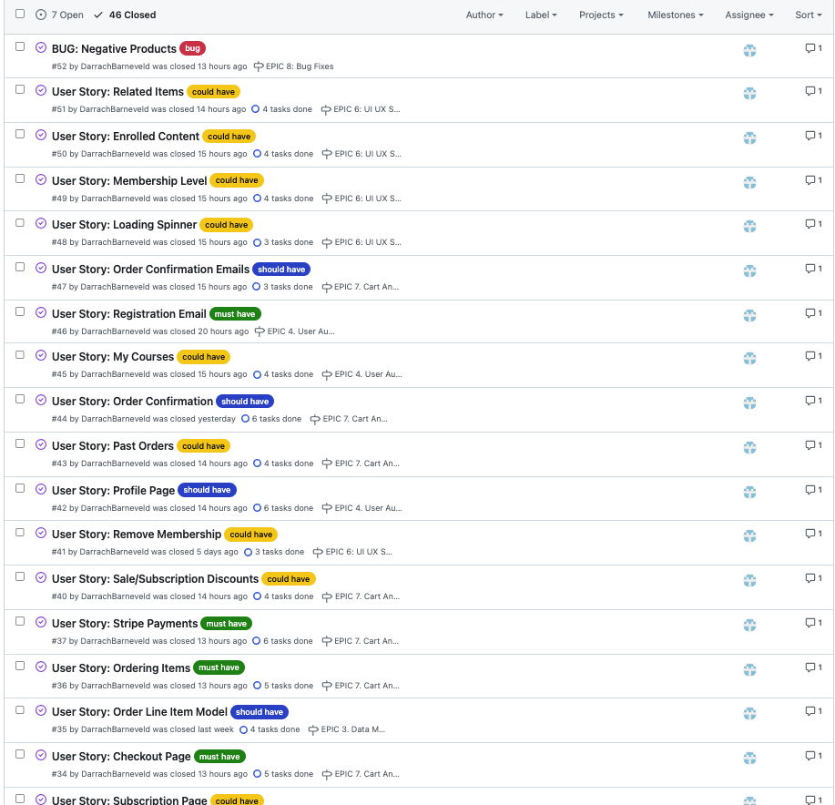

#### MoSCoW Prioritisation

The project utilised the "MoSCoW" technique to categorise and prioritise features and requirements effectively. "MoSCoW" represents "Must have, Should have, Could have, and Won't have," aiding in organising and prioritising features. This method guides the development process, ensuring that critical elements are addressed as a top priority.

MoSCoW

#### GitHub Projects/Kanban

The project implemented a simple Kanban Board structure, comprising columns like Todo, In Progress, and Done. This arrangement offered a well-organised method for monitoring task progress, facilitating visualising and managing the workflow during development. The GitHub project Kanban was linked to the repository for consistent reference.

Kanban

## Features

### Navigation Header

The navigation bar is a consistent element across all pages, designed using Bootstrap and optimised for full responsiveness. The left is centered around navigation of content while the right hand side is related to user authentication. Authenticated users can also see create posts and view profile links while unauthenticated users only see a prompt to login/register.

The mobile version of the navbar has all the content rendered when a hamburger icon is clicked. When clicked a dropdown display is rendered showing all navigation links.

Navbar

Mobile

### Home Page

The homepage serves as the central hub of the site, providing visitors with an overview of its offerings, including featured products, testimonials, imagery, and marketing copy. It serves as a gateway to navigate the store sections through shop now navigation links, inviting users to explore further and discover more about the brand's offerings and value propositions. It uses the fold of the screen to showcase branding imagery.

Home

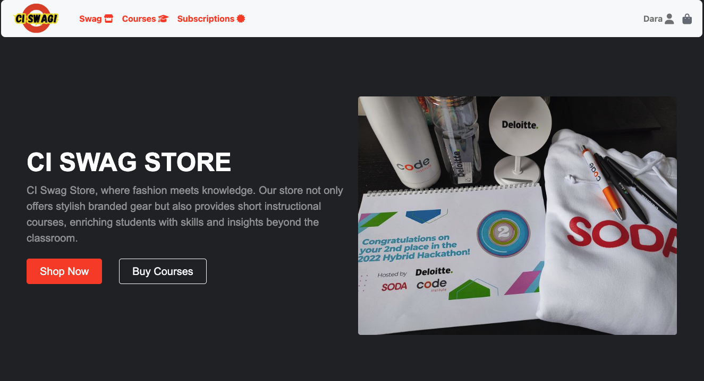

### Products Page

The products page showcases preview cards of various products, each accompanied by basic descriptions and images, offering users a quick overview of available items. A filtering system based on categories, prices, sales, and ratings, so users can refine their search to find desired products. Additionally, a search bar enables users to explore specific items, enhancing their browsing experience and allowing them to refine very specific requests.

Products

### Programs Page

Similar to the products page, the programs page presents preview cards of different educational programs, providing brief descriptions and images to offer users a glimpse into each program's content and offerings. Searchbar and filtering tools remain consistant with the products page

Products

### Programs Page

Similar to the products page, the programs page presents preview cards of different educational programs, providing brief descriptions and images to offer users a glimpse into each program's content and offerings. Searchbar and filtering tools remain consistant with the products page

Products

### Subscriptions Page

The subscription page displays available membership packages, presenting users with a clear overview of the various subscription options offered. Users can easily identify their current membership package, allowing for seamless management and potential upgrades or downgrades as needed. This page provides transparency and accessibility for users to make informed decisions regarding their subscription preferences.

Subscriptions

### Product Detail Page

The product detail page contains information about the selected product, including price, rating, sale status, and SKU. Featuring an image of the product, users can view it before making a purchase decision. Additionally, the page lists related products at the bottom, offering users additional options to explore. With the option to adjust the quantity and an "Add to Cart" button where users can update there cart with a product quantity.

Product Detail

### Program Detail Page

The program detail page provides in-depth information about the selected program, including its name, duration, cost, and a breakdown of modules or sections covered. Users can gain an understanding of the program's content and structure before making a decision. Users must be authenticated before they can enroll in courses and users who have purchased the program, a related video is displayed, offering valuable insights or introductory content to enhance the learning experience.

Program Detail

### Cart Page

The cart page displays a summary of the items currently in the user's cart, presenting essential information such as product details and quantities. Additionally, users can view the total cost of all items in their cart as well as any discounts to certain items. This page serves as a hub users to review and manage their selected items before proceeding to checkout.

Cart

### Checkout Page

The checkout page streamlines the purchasing process, guiding users through the final steps of completing their orders. Users can review their selected items, input shipping and payment information. Users can add email changes and name changes for orders, but this will only affect a singler purpose. The checkout page provides order summary details, ensuring transparency regarding the total cost, including discounts and shipping fees. Stripe payment elements are used to handle the payment processing

Checkout

### Confirmation Page

The thank you and order confirmation page serves as a final acknowledgment of the user's completed purchase, expressing gratitude for their patronage. It provides a summary of the order details, including items purchased, total cost, and shipping information. Additionally, users may receive confirmation numbers or order IDs for reference. This page also serves as the order history page so users can review all orders they have purchased.

Confirmation

### Profile Page

The profile page is where users can easily update their user details such as name and username as well as and edit delivery information. Users can access a overview of their past orders, allowing them to track their purchase history and review previous transactions.

Profile

### My Course Page

The my course page gives authenticated users quick access to view there total purchased courses. It shows a list of all program preview cards for courses that have been purchased in their order history.

Profile

### Sign In page

This page comprises a form with fields for entering a username and password. Beneath the form is the sign up button which submits the form. Below the form is a redirect to the register page if the user does not have an account. Click the remember me checkbox to remain logged in as a session.

Sign In

### Sign Up page

It features a form with fields for inputting name, email, username, password, and password confirmation. Underneath the form, there is a link to log in for users with existing accounts, followed by the signup button. After signup, users receive a welcome email at the provided email address and are then directed to the home page.

Sign Up

### Sign out page

Upon clicking the "log out" link in the navigation, users are directed to a confirmation page. This page includes a cautionary message and two buttons: one for returning and one for logging out.

Sign Out

### Notification Messages

Notification messages were user every time the user performs CRUD operation, sign in, and sign out.

Notifications

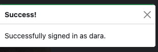

### Confirmation Modal

This modal appears whenever a users is performing a delete CRUD operation. It ensures the user must confirm their action before the permanent deletion of a subscription

Confirmation Modal

### Error Pages

Custom Error pages are rendered to show the user what went wrong with their request. These error pages allow the user to redirect to the home page.

Examples below are 403, 404

403

404

